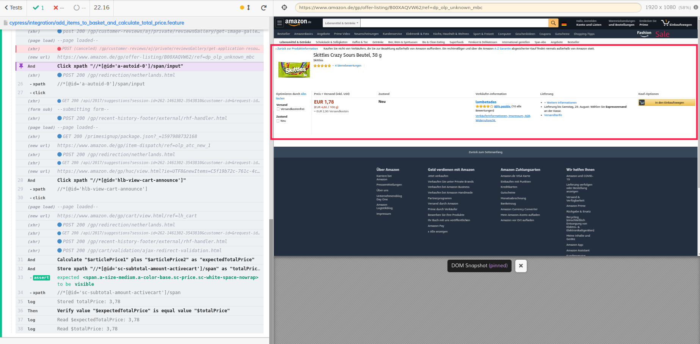
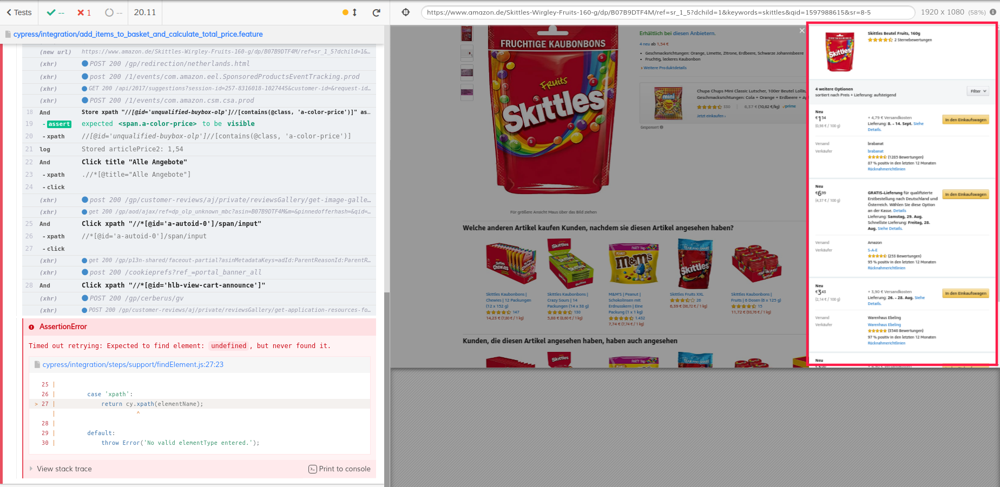
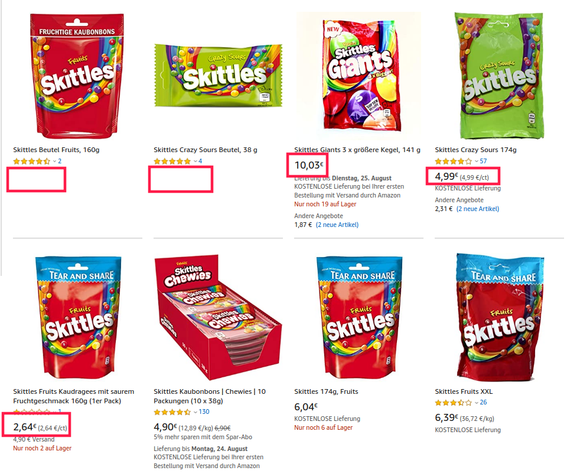
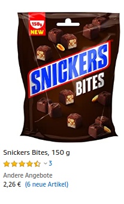
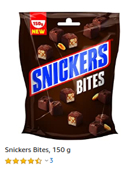

# cypress-amazon-sample

## Requisites

-   have NodeJs and NPM installed

Click [here](https://nodejs.org/en/download/package-manager/) for more details.

## Get started

```bash
npm install
npm run test-e2e
```

After cypress has launched, either click a specific test case on the left or choose to run all specs in the top right corner (might take a while to finish loading).

## Structure

The cypress folder:

```bash
integration/
  - common/                # regular expressions for "When" and "Then" steps
  - steps/
    - action               # the step definition for "When" steps
    - support              # helper functions for step definitions
    - verification         # the step definition for "Then" steps
  - *.feature              # feature files describing the tests written in Gherkin
```

## Test philosophy

Best practice is to split down the story to test into several separate test cases that focus on one thing.

So I ended up with:

1.  Finding an article, to test the basic search functionality. So that other test can skip this part, by just using a query parameter.
2.  Find the cheapest articles
3.  Adding two items to the basket, sum up the prices and compare them with the basket value
4.  Add an article to the basket, proceed to checkout and check the login / registration screen

For selectors I had to use a mix of classes, xpaths, ids, data-indices and titles. Best practise would be to create a testing-only data-attribute that is independent from the UI. This will be always stable and Automation Engineers can rely on that.

## Known issues / faced problems during implementation

### A/B testing

Amazon runs an A/B test on dealer selection.
Best practice would be to write 2 tests, handling both different variations on the dealer selection.  
But without having internal knowledge on Amazon's A/B tests and how to force A or B, it is not possible to control this behavior.

It might happen, that this test case fails. (at the time of writing it is about 50%)




### Newer Cypress major version has been released

While developing Cypress 5 has been published. As this is a major upgrade, it needs more attention.  
To be on the safe and stable side, I decided to remain on the latest version of 4.

You might see a hint that there is a newer version, when running the tests.

### Price sorting

Although the sorting in the results list is price ascending, it does not sort correct.  
I don't know how exactly Amazon's sort algorithm works. But for sure, it is not easy as just by price.



The testcase will most likely fail, as the sorting is actually not correct.

### Displaying of prices

It might also happen that some articles do not show a price at all in the list. But when you click the aticle it displays a price.




The testcase will most likely fail, as the actual displaying of prices it not reliable.

### Captchas

When you run too many tests a captcha might come up. As this is a protection against bots (and tests are nothing else then bots) it is not possible to bypass them. Solve the captcha manually and you should be fine for the next test runs.

---

Considering the known issues and retrying the tests will finally succeed.


## Definitions

<!-- Generated by documentation.js. Update this documentation by updating the source code. -->

#### Table of Contents

-   [then](#then)
    -   [checkText](#checktext)
        -   [Parameters](#parameters)
        -   [Examples](#examples)
    -   [checkUrl](#checkurl)
        -   [Parameters](#parameters-1)
        -   [Examples](#examples-1)
    -   [compareValue](#comparevalue)
        -   [Parameters](#parameters-2)
        -   [Examples](#examples-2)
-   [when](#when)
    -   [calcValue](#calcvalue)
        -   [Parameters](#parameters-3)
        -   [Examples](#examples-3)
    -   [click](#click)
        -   [Parameters](#parameters-4)
        -   [Examples](#examples-4)
    -   [openPath](#openpath)
        -   [Parameters](#parameters-5)
        -   [Examples](#examples-5)
    -   [typeInto](#typeinto)
        -   [Parameters](#parameters-6)
        -   [Examples](#examples-6)
    -   [storeValue](#storevalue)
        -   [Parameters](#parameters-7)
        -   [Examples](#examples-7)

### then

#### checkText

Checks text on a given element.

##### Parameters

-   `elementType` **[string](https://developer.mozilla.org/docs/Web/JavaScript/Reference/Global_Objects/String)** Type of the element (class|data-index|id|tag|title|xpath)
-   `elementName` **[string](https://developer.mozilla.org/docs/Web/JavaScript/Reference/Global_Objects/String)** Name of the element
-   `falseCase` **[boolean](https://developer.mozilla.org/docs/Web/JavaScript/Reference/Global_Objects/Boolean)** Check, whether the text is or is not on the given element
-   `expectedText` **[string](https://developer.mozilla.org/docs/Web/JavaScript/Reference/Global_Objects/String)** Text, that will be validated on the given element

##### Examples

```javascript
Verify {elementType} "{elementName}"( not) with text "{expectedText}"
```

```javascript
Verify class "s-result-list" with text "Amazon Testartikel"
```

```javascript
Verify class "s-result-list" not with text "unbekannter Artikel"
```

#### checkUrl

Checks, that a specific string is included in the url

##### Parameters

-   `expectedUrl` **[string](https://developer.mozilla.org/docs/Web/JavaScript/Reference/Global_Objects/String)** Part of the url, that will be validated

##### Examples

```javascript
Verify url contains {expectedUrl}
```

```javascript
Verify url contains "/?query=sample"
```

#### compareValue

Compares two values with each other.

##### Parameters

-   `valueName1` **[string](https://developer.mozilla.org/docs/Web/JavaScript/Reference/Global_Objects/String)** 1st input
-   `operator` **[string](https://developer.mozilla.org/docs/Web/JavaScript/Reference/Global_Objects/String)** comparison operator (less than|greater than|equal|not equal)
-   `valueName2` **[string](https://developer.mozilla.org/docs/Web/JavaScript/Reference/Global_Objects/String)** 2nd input

##### Examples

```javascript
Verify value "{valueName1}" is {operator} value "{valueName2}"
```

```javascript
Verify value "$vehicleTotal" is less than value "$sumTotal"
```

### when

#### calcValue

Calculates two stored keys based on the operator. Works only with € currency.
Requires, that keys are stored first.

##### Parameters

-   `valueName1` **[string](https://developer.mozilla.org/docs/Web/JavaScript/Reference/Global_Objects/String)** 1st input
-   `operator` **[string](https://developer.mozilla.org/docs/Web/JavaScript/Reference/Global_Objects/String)** Math operator (plus|minus|multiply by|divide by)
-   `valueName2` **[string](https://developer.mozilla.org/docs/Web/JavaScript/Reference/Global_Objects/String)** 2nd input
-   `result` **[string](https://developer.mozilla.org/docs/Web/JavaScript/Reference/Global_Objects/String)** The result is saved in this variable name.

##### Examples

```javascript
Calculate "{valueName1}" {operator} "{valueName2}" as "{result}"
```

```javascript
Calculate "$articlePrice1" plus "$articlePrice2" as "totalPrice"
```

#### click

Clicks a given element.

##### Parameters

-   `elementType` **[string](https://developer.mozilla.org/docs/Web/JavaScript/Reference/Global_Objects/String)** Type of the element (class|data-index|id|tag|title|xpath)
-   `elementName` **[string](https://developer.mozilla.org/docs/Web/JavaScript/Reference/Global_Objects/String)** Name of the element

##### Examples

```javascript
Click {elementType} "{elementName}"
```

```javascript
Click class "nav-search-submit-text"
```

#### openPath

Opens a page by a given path.

##### Parameters

-   `path` **[string](https://developer.mozilla.org/docs/Web/JavaScript/Reference/Global_Objects/String)** Path that will be opened, auto-prefixed with baseurl of the current application/environment.

##### Examples

```javascript
Open path "{path}"
```

```javascript
Open path "/trade-in"
```

#### typeInto

Write text into a form field element.

##### Parameters

-   `value` **[string](https://developer.mozilla.org/docs/Web/JavaScript/Reference/Global_Objects/String)** Value, that will be inserted into form field element
-   `elementType`
-   `elementName`
-   `Name` **[string](https://developer.mozilla.org/docs/Web/JavaScript/Reference/Global_Objects/String)** of the form field element

##### Examples

```javascript
Type "{value}" into input with (id|class) "{elementName}"
```

```javascript
Type "Amazon Testartikel" into input with id "twotabsearchtextbox"
```

#### storeValue

Stores a value from a given element as a key in the session store.

##### Parameters

-   `elementType` **[string](https://developer.mozilla.org/docs/Web/JavaScript/Reference/Global_Objects/String)** Type of the element (class|data-index|id|tag|title|xpath)
-   `elementName` **[string](https://developer.mozilla.org/docs/Web/JavaScript/Reference/Global_Objects/String)** Name of the element
-   `key` **[string](https://developer.mozilla.org/docs/Web/JavaScript/Reference/Global_Objects/String)** Key, that holds the stored element

##### Examples

```javascript
Store {childType} "{childName}" as "{key}"
```

```javascript
Store class "price" as "articlePrice"
```
